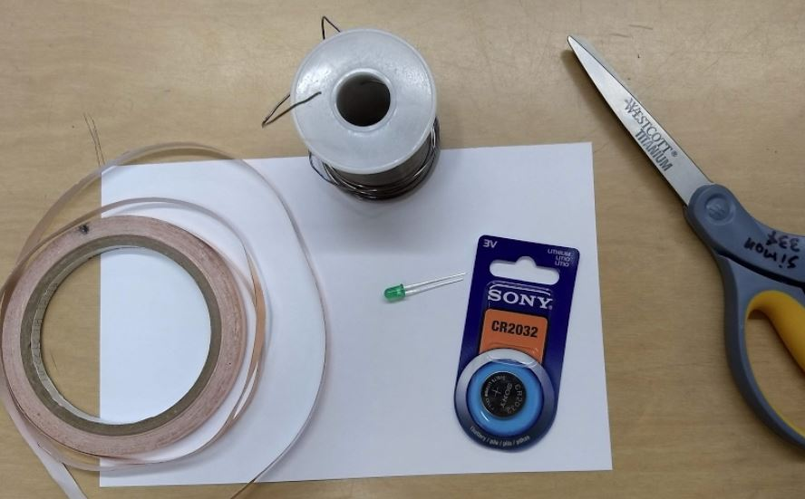
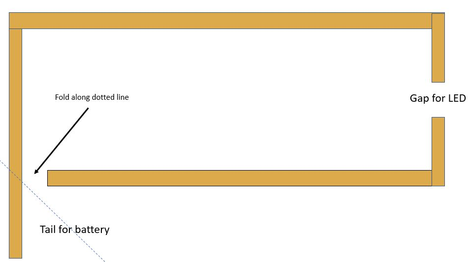
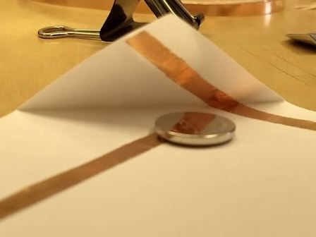
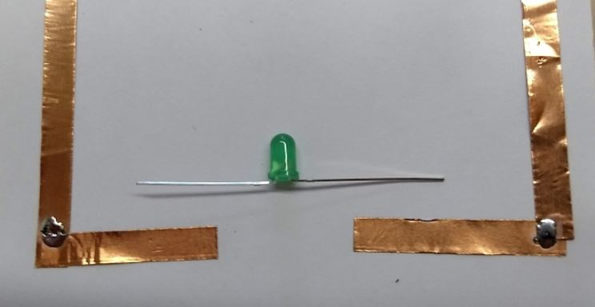
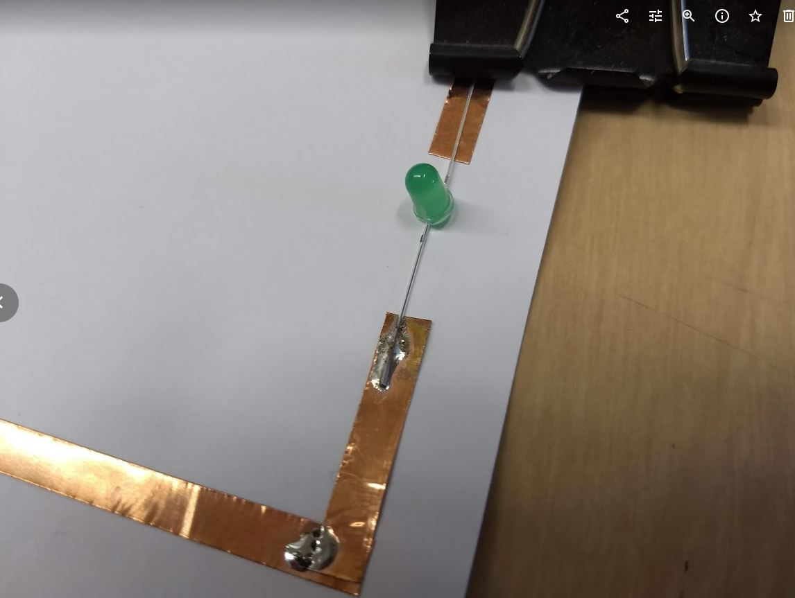
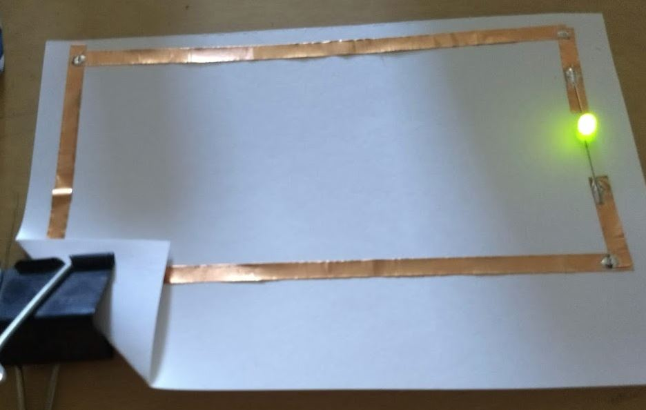
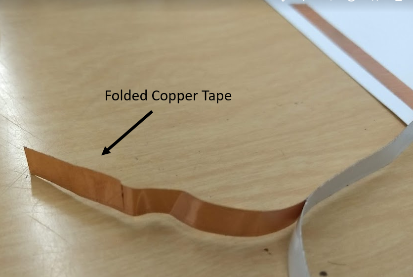
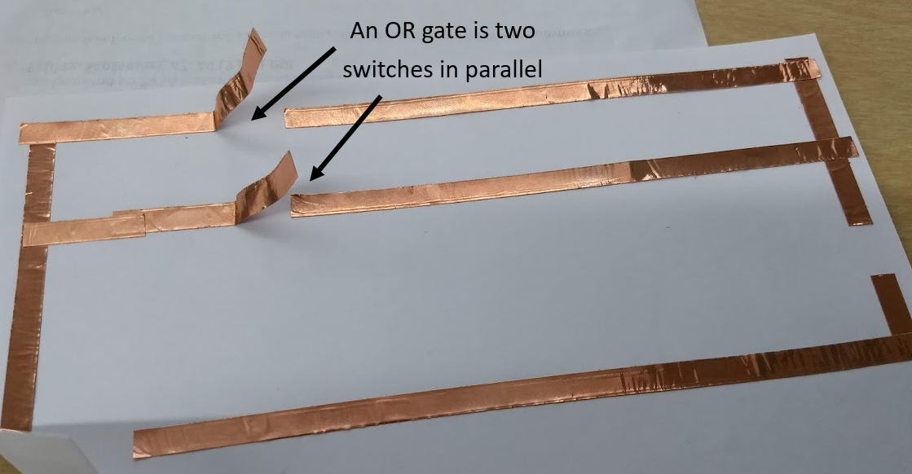

Build logic gates with paper circuits 
----------------------------------------------
In this lab you will build three circuits: a basic circuit, an ***AND*** gate and an ***OR*** gate. For materials you will need the following:
* card stock (paper)
* copper tape
* button cell battery (e.g. CR2032)
* LED (or buzzer)
* scissors
* binder clip
* OPTIONAL: soldering iron and solder 

Build a basic circuit
---------------------
To make the basic circuit, stick copper tape on the card stock in the following shape with a "tail" to fold over the battery and a gap for the LED.   
   
The tail will fold over the top of the button cell battery as shown below,   
    
If you have have a soldering iron you can solder each place where separate pieces of tape meet.   
    
Bend the leads of the LED out as shown and then tape or solder it into place. If you are soldering, you may find the binder clip helpful to keep the LED from moving as you solder the leads.   
 
When you are finished, put the battery in position between the tail and the rest of the circuit. You can use the binder clip to hold the battery in place. If the LED doesn't light up, flip the battery over upside down. The LED should light up as shown below.   
    

Add switches to make ***AND*** and ***OR*** gates
---------------------
***AND*** and ***OR*** gates both use switches in different configurations. To make a switch, fold about an inch of copper tape back over itself like shown below
   

To make an ***AND*** gate put two switches in series in a circuit as shown below.   
   

To make an ***OR*** gate put two switches in parallel in a circuit as shown below.  
 

*This assignment is based on Jie Qi's [High-Low Tech Paper Circuits](http://highlowtech.org/?p=2505)*
