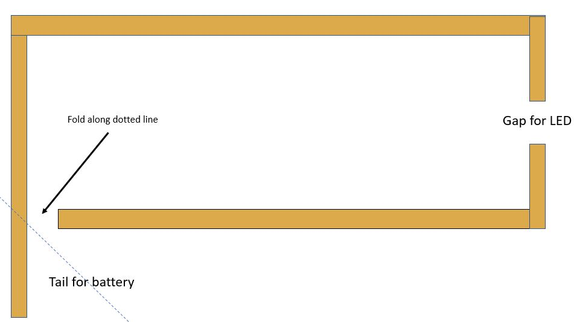

Build logic gates with paper circuits 
----------------------------------------------
In this lab you will build three circuits: a basic circuit, an and gate and an or gate. For materials you will need the following:
* card stock (paper)
* copper tape
* button cell battery (e.g. CR2032)
* LED (or buzzer)
* scissors
* binder clip
* solder
* soldering iron    

Build a basic circuit
---------------------
The basic circuit will have the following shape with a "tail" to fold over the battery and a gap for the LED.   
   
The tail will fold over the button cell battery as shown below   
    
Solder each place where seperate pieces of tape meet.   
 
Bend the wires of the LED out as shown and solder it into place. You may find the binder clip helpful to keep the LED from moving as you solder the leads.   
 
